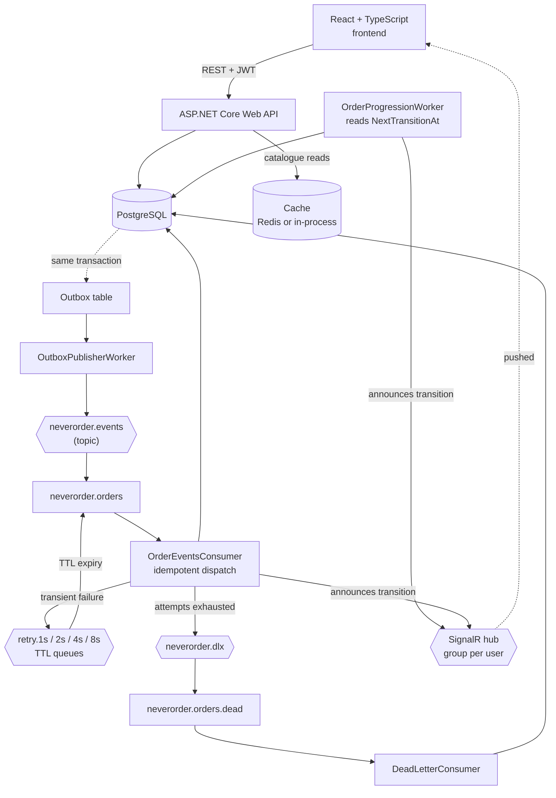

# NeverOrder

**Shop. Order. Track. Never Pay.**

NeverOrder is a virtual commerce platform. You can browse a catalogue, build a cart, place an order and
watch it move from *Created* all the way to *Delivered* — but **no payment is ever taken, nothing is ever
shipped, and no real transaction occurs anywhere in the system.** It exists to demonstrate production-shaped
C#/.NET backend engineering: clean architecture, asynchronous processing, message-driven workflows,
relational modelling and realistic failure handling.

---

## Contents

- [What works today](#what-works-today)
- [Architecture](#architecture)
- [Technology](#technology)
- [Getting started](#getting-started)
- [Running the tests](#running-the-tests)
- [API documentation](#api-documentation)- [Example user flow](#example-user-flow)
- [Engineering decisions](#engineering-decisions)
- [Repository layout](#repository-layout)
- [Roadmap](#roadmap)

---

## What works today

Phases 1 to 4 are complete.

**The end-to-end journey**

- Registration and login with ASP.NET Core Identity, issuing JWT access tokens.
- Product catalogue with search, category and price filtering, sorting and pagination.
- Per-user shopping cart with server-side validation and totals.
- Virtual checkout that re-validates every line against the live catalogue.
- Asynchronous order progression: `Created → Confirmed → Preparing → OutForDelivery → Delivered`.
- Order history, order detail and a live-updating order tracking page.
- React + TypeScript frontend covering the whole journey.

**Real time**

- SignalR hub with one group per user, so a connection can only ever be reached through its own id.
- The tracking page is pushed to rather than polling, and falls back to polling if the hub cannot connect.
- Optional Redis backplane, so a notification still reaches the user when another instance raised it.

**Reliable messaging**

- Transactional outbox: events are written in the same transaction as the state change that caused them.
- Idempotent consumers: a composite `ProcessedEvent` key makes duplicate delivery a no-op.
- Bounded retries with exponential backoff (1s, 2s, 4s, 8s) using broker TTL queues — no plugin required.
- Dead-letter queue with the failure reason, attempt count and payload persisted for inspection.
- Every background component backs off when a dependency is down instead of flooding the logs.

**Operability**

- Read-through catalogue caching with version-key invalidation, on Redis or in-process.
- `xmin` optimistic concurrency on orders, so two instances cannot advance the same order twice.
- Separate liveness and readiness probes, each dependency registering its own check.
- Structured Serilog logging with a correlation id that survives the broker hop.
- Rate limiting, per account when signed in and per address when not.

69 unit tests cover the order state machine, order and cart arithmetic, the simulation schedule and the
retry ladder. 14 further tests cover persistence mapping, cache invalidation and per-user notification
routing, and need no running services.

---

## Architecture



The solution follows a clean-architecture dependency rule, enforced purely by project references:

```
Domain  ←  Application  ←  Infrastructure  ←  Api
```

`NeverOrder.Domain` has **zero NuGet dependencies**. It holds entities, the order state machine and event
contracts, and knows nothing about EF Core, ASP.NET or RabbitMQ. ASP.NET Identity types live in
Infrastructure; domain aggregates reference a user only by `Guid`.

### Who moves an order forward

Exactly one component owns each transition, so there is no race and no double-advance:

| Transition | Owner | Trigger |
| --- | --- | --- |
| `Created → Confirmed` | `OrderEventsConsumer` | The `OrderCreated` message from RabbitMQ |
| Everything after | `OrderProgressionWorker` | `Order.NextTransitionAt` falling due |

---

## Technology

| Concern | Choice |
| --- | --- |
| Runtime | .NET 8 (pinned via `global.json`) |
| API | ASP.NET Core Web API, controllers |
| Database | PostgreSQL 16 + EF Core 8 (Npgsql) |
| Auth | ASP.NET Core Identity + JWT bearer |
| Messaging | RabbitMQ via `RabbitMQ.Client` 7.x (async API, no MassTransit) |
| Real time | SignalR, per-user groups, optional Redis backplane |
| Caching | `IDistributedCache` — Redis when configured, in-process otherwise |
| Concurrency | PostgreSQL `xmin` as an EF Core row version |
| Logging | Serilog, structured, with request correlation ids |
| Throttling | Built-in ASP.NET Core rate limiter |
| Health | `Microsoft.Extensions.Diagnostics.HealthChecks` |
| Validation | FluentValidation |
| Errors | `IExceptionHandler` + RFC 7807 `ProblemDetails` |
| Frontend | React 19, TypeScript, Vite, TanStack Query, React Router |
| Tests | xUnit, FluentAssertions, NSubstitute |
Package versions are pinned centrally in `Directory.Packages.props`.

---

## Getting started

### Prerequisites

- .NET 8 SDK
- Node.js 20+
- Git
- Docker Desktop, for PostgreSQL, Redis and RabbitMQ — optional, see [Running without Docker](#running-without-docker)

### 1. Start the infrastructure

```bash
cp .env.example .env
docker compose up -d
```

This brings up PostgreSQL (`5432`), Redis (`6379`) and RabbitMQ (`5672`, management UI on
<http://localhost:15672>). Wait until all three report healthy:

```bash
docker compose ps
```

### 2. Configure secrets

Nothing secret is committed. Set the JWT signing key and the seed administrator password locally:

```bash
cd backend/NeverOrder.Api
dotnet user-secrets set "Jwt:SigningKey" "<at least 32 random characters>"
dotnet user-secrets set "Seed:AdminPassword" "<a strong password>"
```

> In Development the API will generate a throwaway signing key if you skip this, so you can run
> immediately — but tokens will stop working after each restart. Outside Development a missing key is a
> hard startup failure.

### 3. Run the backend

```bash
dotnet run --project backend/NeverOrder.Api
```

On first run in Development the app applies EF Core migrations and seeds six categories, 40 products and
the administrator account. It listens on <http://localhost:5038> and opens Swagger.

### 4. Run the frontend

```bash
cd frontend
npm install
npm run dev
```

Open <http://localhost:5173>.

### Running without Docker

Only PostgreSQL is a hard requirement. Redis is declared in `docker-compose.yml` but no code reads it,
and RabbitMQ can be switched off.

**1. Start a repo-local PostgreSQL.** `scripts/pg-local.ps1` downloads the official EnterpriseDB Windows
binaries into `.postgres/`, initialises a cluster and starts it on `localhost:5432` with the role and
database this project expects. Nothing is installed outside the repository, no administrator rights are
needed and no Windows service is registered.

```powershell
./scripts/pg-local.ps1                  # download (~320 MB, first run only), init, start
./scripts/pg-local.ps1 -Action Status
./scripts/pg-local.ps1 -Action Stop
```

The cluster keeps running after you close the terminal. To start over, stop it and delete `.postgres/`.

**2. Turn the broker off.**

```powershell
dotnet user-secrets set "RabbitMq:Enabled" "false" --project backend/NeverOrder.Api
```

Events are then logged instead of published and `OrderProgressionWorker` takes over order confirmation,
so the full journey still works — the outbox, retry ladder and dead-letter path are simply not exercised.

Steps 3 and 4 of [Getting started](#getting-started) are unchanged.

### Caching

Catalogue reads are cached read-through. Out of the box the cache is in-process, which is correct for a
single instance and needs nothing installed. Point it at Redis to share one across instances:

```powershell
dotnet user-secrets set "Cache:Redis" "localhost:6379" --project backend/NeverOrder.Api
```

That is the Redis `docker-compose.yml` already starts. `Cache:Enabled=false` bypasses caching entirely,
and a cache that is unreachable degrades to a miss rather than an error. The same connection string also
turns on the SignalR backplane, which is what live tracking needs once more than one instance is running.

### Working with migrations
```bash
dotnet tool restore
dotnet tool run dotnet-ef migrations add <Name> \
  --project backend/NeverOrder.Infrastructure \
  --startup-project backend/NeverOrder.Api \
  --output-dir Persistence/Migrations
```

---

## Running the tests

```bash
dotnet test
```

The unit suite covers every legal **and illegal** order transition, order and cart money arithmetic, and
the simulation delay configuration. A second suite covers the persistence mapping that keeps aggregate
children inserts rather than updates, the cache's version-key invalidation, and the rule that a live
notification only ever reaches its own user. Neither suite needs a database, a broker or a cache, so
`dotnet test` runs on a bare checkout. Service-backed integration tests arrive in a later phase.

---

## API documentation

Swagger UI is served at <http://localhost:5038/swagger> in Development, including the bearer security
scheme — use **Authorize** and paste the `accessToken` from `/api/auth/login`.

| Method | Route | Auth | Purpose |
| --- | --- | --- | --- |
| `POST` | `/api/auth/register` | — | Create an account |
| `POST` | `/api/auth/login` | — | Exchange credentials for a token |
| `GET` | `/api/products` | — | Search, filter, sort, paginate |
| `GET` | `/api/products/{id}` | — | Product detail |
| `GET` | `/api/categories` | — | Active categories |
| `GET` | `/api/cart` | ✔ | Current cart |
| `POST` | `/api/cart/items` | ✔ | Add an item |
| `PUT` | `/api/cart/items/{productId}` | ✔ | Set quantity |
| `DELETE` | `/api/cart/items/{productId}` | ✔ | Remove an item |
| `DELETE` | `/api/cart` | ✔ | Clear the cart |
| `POST` | `/api/orders` | ✔ | Place a virtual order |
| `GET` | `/api/orders` | ✔ | Paged order history |
| `GET` | `/api/orders/{id}` | ✔ | Order detail with status history |
| `GET` | `/api/orders/{id}/tracking` | ✔ | Tracking timeline |
| `GET` | `/health/live` | — | Is the process alive? Checks no dependencies |
| `GET` | `/health/ready` | — | Can this instance serve traffic? Reports each dependency |
| `WS` | `/hubs/orders` | ✔ | Live order status, pushed to the signed-in user only |

The hub sends one message, `orderStatusChanged`, carrying the order id, number, previous and new status,
and whether the order is finished. Clients cannot subscribe to an order: membership is derived from the
token, so there is no id to tamper with.

Every response carries an `X-Correlation-Id`. Send your own and it is echoed and threaded through the
logs, including the logs of work the broker performs later; send nothing and one is generated.

`POST /api/orders` takes **no request body**. Prices and totals are always computed on the server from the
live catalogue; the client is never trusted with money.

---

## Example user flow

1. Register at <http://localhost:5173/register>.
2. Browse the catalogue, filter by *Electronics*, sort by price.
3. Add a couple of items to the cart and adjust quantities.
4. Review the cart. The summary states plainly: *No payment will be charged. This is a simulated order.*
5. Place the virtual order — the API responds immediately with an order number.
6. Watch the tracking page advance through Confirmed, Preparing, Out For Delivery and Delivered over
   roughly twenty seconds, without reloading.
7. Open **Orders** to see the order in your history with its full status trail.

---

## Engineering decisions

**The scheduler's queue lives in the database, not in memory.** Each order stores `NextTransitionAt`. A
`PeriodicTimer`-driven worker asks "which orders are due?" rather than holding a `Task.Delay` per order.
Restart the API mid-order and progression resumes exactly where it left off — the alternative silently
strands orders.

**RabbitMQ owns delivery, the scheduler owns timing.** Rather than making the broker decorative, the
`OrderCreated` event is the sole trigger for confirmation while the scheduler drives later transitions.
Both components do real work and neither can advance the same order twice.

**Money never comes from the client.** The cart stores a price snapshot for display only. Checkout re-reads
every product from the catalogue, re-checks availability, and recomputes the total server-side.

**One `SaveChanges`, one transaction.** Creating the order, its items, its opening status-history row and
clearing the cart all happen in a single `SaveChangesAsync`, so a failure cannot leave a half-placed order.

**Another user's order is a 404, not a 403.** Order queries filter by the `sub` claim inside the predicate,
so an id belonging to someone else is indistinguishable from one that does not exist.

**Uniform login failure.** Unknown email and wrong password return the identical error, so accounts cannot
be enumerated.

**Enums are stored as text.** `Status` columns hold `Preparing`, not `2`, which keeps the database readable
during demos and debugging at negligible cost.

**Consumers copy the payload before awaiting.** RabbitMQ.Client 7 may reclaim the delivery buffer as soon as
the handler returns, so `ea.Body.ToArray()` happens before any `await`.

**Unreadable messages are never requeued.** A malformed payload is nacked with `requeue: false`, which lets
the queue's dead-letter exchange carry it away without burning a retry attempt on something that can never
succeed.

**Nothing publishes to the broker directly.** Business code calls `IEventPublisher`, which writes an outbox
row inside the caller's transaction. Only `OutboxPublisherWorker` talks to RabbitMQ. Stop the broker
mid-checkout and the order still commits; the event drains when the broker returns.

**Retries use TTL queues, not a plugin and not `Thread.Sleep`.** A failed message is republished to a
`retry.Ns` queue whose TTL dead-letters it back into the main queue. Backoff therefore survives a consumer
crash, and the delay costs no memory or threads.

**Idempotency is enforced by a primary key, not a check.** The `ProcessedEvent` row is inserted before the
handler runs and committed by the same `SaveChanges`, so the guard and the work it protects share one
transaction. A racing duplicate loses the insert and is acknowledged as already done.

**Background workers back off when dependencies fail.** A 500 ms poll loop against a downed database would
otherwise emit a stack trace twice a second. Each worker logs full detail once, then a single summary line
per attempt, doubling the interval up to a cap.

**Aggregate ids are assigned by the domain, and the mapping says so.** Every entity sets its own `Guid` in
its constructor. EF treats `Guid` keys as store-generated by convention, so a child reached through a
tracked parent's navigation looks like a row that already exists: EF emits an `UPDATE` matching nothing
instead of an `INSERT`. Declaring those keys never-generated is what makes `cart.AddOrIncrease(...)` and
`order.TransitionTo(...)` persist. It is applied as one model-wide rule rather than per entity, because the
next entity someone adds would otherwise reintroduce the bug silently.

**`xmin` is the concurrency token, so it costs nothing to store.** PostgreSQL already stamps every row with
the transaction that last wrote it. Mapping that system column adds no schema and no write amplification,
and it turns "exactly one component owns each transition" from a convention into something the database
enforces: a second instance's `UPDATE ... WHERE xmin = @original` matches zero rows and is skipped.

**Carts deliberately have no concurrency token.** Two tabs adding *different* products do not actually
conflict, and a token would turn that into a spurious 409. The one real conflict — the same product twice —
is already refused by the unique index on `(CartId, ProductId)`.

**Cache invalidation publishes a new version, it does not delete keys.** Every catalogue key embeds a
version token. Invalidating writes one new token, which orphans the entire previous generation at once
and lets it expire on its own. The alternative — tracking and deleting every key derived from the
catalogue — is the part that usually goes wrong, and it gets slower the better the cache is working.

**A cache outage degrades speed, not correctness.** Reads and writes that throw are logged and treated as
misses, so an unreachable Redis makes the application slower and never breaks it. The same code runs
against an in-process cache when no Redis is configured, so there is no untested second path.

**Liveness checks nothing.** `/health/live` reports only that the process is running. If it checked the
database, one outage would make an orchestrator restart every healthy instance at once and turn a
degradation into a total failure. `/health/ready` is where dependencies belong, and each dependency
registers its own probe next to its own registration so the two cannot drift apart.

**Rate limits are keyed by account where possible.** Partitioning solely by IP throttles everyone behind
one NAT or corporate proxy as though they were a single client. Signed-in callers are partitioned by their
`sub` claim, which is why the limiter runs after authentication. Login and registration cannot know the
caller yet, so they get a tighter, address-keyed policy of their own.

**Correlation ids survive the broker.** The id is read from `X-Correlation-Id` or generated, then written
into the event envelope stored in the outbox. When a consumer picks that message up — possibly minutes
later, on another machine — it restores the id into its log scope, so the work an HTTP request caused is
searchable from the request. An inbound id is sanitised and length-capped first: it ends up in a response
header and in every log line, and neither is a safe place for unvalidated input.

**Live updates hang off the transition, not off the message.** Announcing from the broker consumer would
have been the obvious place, but confirmation is only the consumer's job while the broker is enabled — so
with `RabbitMq:Enabled=false`, the documented Docker-free setup, live tracking would have silently done
nothing. Raising it from the component that owns the transition means it works in both configurations. It
is raised *after* the commit, so a delivered notification always describes state that really exists, and a
failure to notify is logged rather than allowed to roll back an order that has already moved.

**Clients cannot ask to watch an order.** The hub exposes no subscribe method. A connection joins exactly
one group, `user:{id}`, derived from its own token on connect. A client that could name the order it wants
is a client that could name someone else's, and no amount of server-side checking is as reliable as never
accepting the parameter.

**The hub token travels in the query string, and only for the hub.** Browsers cannot set headers on a
WebSocket handshake, so SignalR falls back to `?access_token=`. That value is accepted only for requests
under `/hubs`, leaving the REST surface header-only — query strings end up in logs and referrers far more
easily than headers do.

**A backplane is what makes this correct with more than one instance.** The instance that advances an
order is rarely the one holding that user's socket. When Redis is configured it also carries SignalR, so
the notification reaches the user wherever they are connected; with a single instance none is needed, and
the code path is identical either way.

**The frontend keeps polling as a fallback.** The tracking page stops its timer only once the hub reports
itself connected. A blocked WebSocket, a proxy that strips upgrades or a failed handshake therefore
degrades to the previous behaviour instead of to a page that silently never updates.

---

## Repository layout

```
.
├── backend/
│   ├── NeverOrder.Domain/          entities, order state machine, event contracts (no dependencies)
│   ├── NeverOrder.Application/     services, DTOs, options, validators
│   ├── NeverOrder.Infrastructure/  EF Core, Identity, RabbitMQ, workers, seeding
│   ├── NeverOrder.Api/             controllers, auth, error handling, Swagger
│   ├── NeverOrder.Tests.Unit/
│   └── NeverOrder.Tests.Integration/
├── frontend/                       React + TypeScript (Vite)
├── scripts/
│   └── pg-local.ps1             repo-local PostgreSQL, no Docker and no installer
├── docker-compose.yml              PostgreSQL, Redis, RabbitMQ
├── Directory.Packages.props        central, pinned package versions
└── global.json                     pins the .NET 8 SDK
```

---

## Roadmap

Phases 1 to 4 are done. Still to come:

- **Phase 5 — admin and dashboard:** catalogue management, dead-letter inspection and replay, and virtual
  spending statistics.
- **Phase 6 — integration tests:** Testcontainers-backed API, database and messaging tests, including a
  forced-failure drill that walks a message through the retry ladder into the dead-letter queue.

---

## A reminder

NeverOrder performs **no real transactions**. There is no payment provider, no merchant, no delivery and no
money. Every price, order and delivery in this application is simulated.
